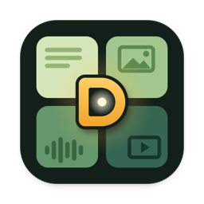

<p align="center"></p>

<h1 align="center">DigUp</h1>

<p align="center">Describe it. Dig it up.</p>

DigUp is a search app for your Mac built on
[EmbeddingGemma 2](https://huggingface.co/google/embeddinggemma-2), the multimodal embedding model Google DeepMind
released in October 2026.

EmbeddingGemma 2 puts text, images, audio and video into one shared space. A photo of a dog on a beach lands next to
the words "a dog on the beach", and a recording of someone talking about sleep lands next to "where they talk about
sleep". It understands more than 100 languages, it's open (Apache 2.0), and at 740M parameters it's small enough to
run comfortably on a laptop.

DigUp brings that to the files on your Mac. Pick the folders to search, and it reads the pictures, PDFs, documents,
recordings and videos in them. Then describe what you're looking for, in your own words, and it finds the match,
whatever kind of file it is. All of it happens on your Mac.

<!-- demo: docs/demo.gif -->

## What you can find

- "zebra in a video" opens the clip at the moment the zebra shows up
- "where they talk about sleep" jumps to that minute of a podcast
- "the clause about pets in the lease" shows the PDF page, with the words marked
- "a dog on the beach" finds the photo, and "payment declined error" the screenshot
- a search in English can find a note written in Bengali, Arabic or any of the model's 100+ languages, and the other
  way around
- "code: retry a failed call with backoff" finds the function in your projects, if you turn on code search

Exact words count too. Invoice numbers, error codes and names are matched as written, in file names, document text
and the text inside screenshots, so a search gets both the meaning and the exact string.

## Private

Nothing you index leaves your Mac. DigUp goes online only to download the model once and to check for updates once a
day. The update check sends nothing about your files, and you can turn it off. No account, no telemetry.

## Install

1. Download the DMG from [Releases](https://github.com/ARahim3/DigUp/releases) and drag DigUp to Applications.
2. Open it. While the model downloads (865 MB, once), pick the folders to search: whole folders, or only some of their
   subfolders. DigUp shows how long the first pass will take for each.
3. Press **⇧⌘Space** in any app and describe what you're looking for.

DigUp needs an Apple Silicon Mac with macOS 14 or later (it's tested on macOS 26), and it keeps itself up to date.

## Using it

| Key | What it does |
|---|---|
| ⇧⌘Space | Opens the search panel from any app (you can change it in Settings) |
| ↓ ↑ | Moves through the results |
| ↩ | Opens the result: videos and recordings at the moment, PDFs with your words in Preview's search, code in your editor at the line |
| Space | Quick Look, at the page or moment (once you've moved to a result) |
| ⌘↩ | Shows it in Finder |
| ⌘C | Copies the file, to paste anywhere |
| ⌘O | The same search in a bigger window, with a picture grid and filters |

DigUp lives in the menu bar, where you can see how indexing is going, pause it, or open Settings. The first time a
video opens at its moment, macOS asks whether DigUp may control QuickTime Player; that's how it jumps there.

## What it reads

Only the folders you choose:

- pictures and screenshots (HEIC, JPEG, PNG, RAW, WebP and more), by what they show, and screenshots by their text too
- PDFs, page by page, scans included. A long one gets its first 30 pages right away and the rest once everything
  else is in (up to 5,000 pages a file)
- documents: txt, md, rtf, doc, docx, odt, html, long ones the same way. Text that's mostly numbers, like a data
  export, is matched by its exact text only
- audio of any length: the model listens to 30 seconds at a time, so DigUp takes overlapping 30-second windows and a
  match points to its moment
- video of any length: a frame every few seconds, one per shot, plus the soundtrack the same way as audio

Outside the folders you pick for code search, it never reads code, and inside a code project (a folder with `.git`,
`package.json` and the like) it reads only screenshots. It never reads keys, certificates, password files, hidden
folders like `~/.ssh`, app bundles or caches. It skips folders that look like datasets, and never downloads iCloud
files that only live in the cloud. You can skip more folders or file types in Settings. DigUp only reads your files;
it never changes, moves or uploads them.

The first pass takes a few minutes for a few hundred files and can take an hour for a big Downloads folder. That
happens once, on battery too unless you tell it to wait for a charger, and it pauses in Low Power Mode. After that, a
new file is searchable a second or two after it lands.

## Code

EmbeddingGemma 2 reads code too, so DigUp can search your projects. Code search is off until you turn it on, in
Settings → Code or during setup, for the folders you pick. Each repo shows how long reading it takes and how much room
its index needs. Then start a search with `code:` and say what the code does, or type a name that's in it:

- "code: retry a failed call with backoff" finds the function, whatever it's called
- "code: refreshAccessToken" goes to the line that defines it, not the places that call it
- "code: plot how many examples each class has" finds the notebook cell

Results open in your editor at the line: Zed, VS Code, Cursor, Xcode, Sublime Text, JetBrains IDEs and a few more
(pick one in Settings). Code has an index of its own and never shows up in other searches. DigUp reads source files,
notebooks (without their outputs) and a repo's own docs. It skips what git ignores, vendored and generated code, data
files, and anything that looks like a key or a password. While you're working on code, the index catches up a minute
after things go quiet.

Reading code takes about 20 seconds for a small app, and about 20 minutes and 130 MB of index for all of llama.cpp.

## How it works

```
your folders ─► readers (ImageIO, PDFKit, AVFoundation, and Vision for the text in screenshots)
             ─► EmbeddingGemma 2 on llama.cpp (Metal), in a helper process that quits when it's done
             ─► one SQLite file: a vector for every picture, page, passage, video frame and 30 s of sound,
                plus a keyword index (code search keeps a second one, for code)
your words   ─► the same model's text part (~250 MB, only while you search) ─► nearest vectors + exact words
```

DigUp runs ggml-org's 8-bit build of EmbeddingGemma 2 through [llama.cpp](https://github.com/ggml-org/llama.cpp) on
the Mac's GPU. Every vector lives in the same 768-dimensional space, which is why one query can rank a video frame
against a PDF page. A search embeds your words in milliseconds and compares them with everything in the index.
Exact-word matches get a boost, because no embedding holds an invoice number exactly.

The index remembers which model version made its vectors. An update that leaves the vectors unchanged keeps your
index, and a test checks every llama.cpp update against stored reference vectors before it ships.

## Build from source

You'll need Xcode 26, git, and CMake (or `uv`) for llama.cpp. If `xcode-select -p` shows the Command Line Tools,
switch to Xcode first (`sudo xcode-select -s /Applications/Xcode.app`): they lack the SwiftUI and Swift Testing
macros the build needs.

```sh
git clone https://github.com/ARahim3/DigUp && cd DigUp
scripts/build-llama.sh            # llama.cpp at a pinned tag, with a one-line patch (a few minutes)
swift build -c release && swift test
./build.sh                        # → build.noindex/DigUp.app
```

There's also a command-line tool, `.build/release/digup`, that indexes, searches and runs the evals from the terminal
(`digup --help`). `scripts/make-testbed.sh` builds a folder of test files to try it on (it needs ffmpeg), and `evals/`
holds the queries ranking changes are measured with.

## FAQ

**How is this different from Spotlight?** Spotlight finds files by their names, text and metadata. DigUp also finds
them by what they show or say, and takes you to the page or moment. The two work fine side by side.

**Why is the download 865 MB?** That's the model: the text part (310 MB) and the image and audio encoders (555 MB).
The app itself is about 20 MB.

**Will it slow my Mac down?** Only the first pass is heavy. After that it reads new files only. The model runs in a
separate process that quits when it's done, and the search side only loads while you're searching.

**Which languages?** The model knows more than 100, and DigUp searches in all of them, across languages too. The evals
cover only English, Bengali and Arabic because those are the languages of the files DigUp was tested on, and Google
notes that the model isn't equally strong in every language. Two limits apply to exact words, not to meaning: inside
screenshots they're read by Apple's text recognition, which knows about 25 languages, and languages written without
spaces, like Chinese, Japanese and Thai, aren't split into words.

**How do I remove it?** Quit it, then delete DigUp.app and `~/Library/Application Support/DigUp`, which holds the
model and the indexes. Its settings are in `~/Library/Preferences/com.abdurrahim.DigUp.plist`.

## Thanks

DigUp is built on [EmbeddingGemma 2](https://huggingface.co/google/embeddinggemma-2) by Google DeepMind (Apache 2.0),
[llama.cpp](https://github.com/ggml-org/llama.cpp) (MIT) and [Sparkle](https://sparkle-project.org) (MIT). Their
license notices ship inside the app, in `DigUp.app/Contents/Resources/Acknowledgements.txt`.

DigUp isn't affiliated with Google or Apple. Gemma is a trademark of Google LLC; Mac and Spotlight are trademarks of
Apple Inc.

## License

MIT
